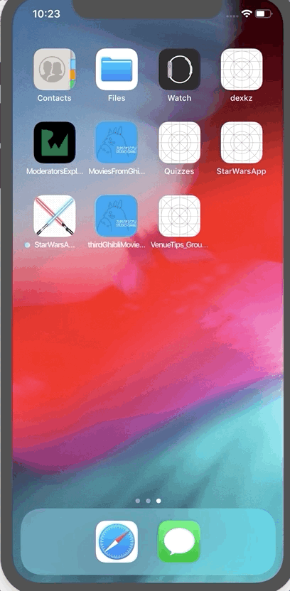

# Star Wars App HF

Star Wars App HF is geared towards troopers that need information about people in the universe when they go on mission. It also offers information about the planets they have to visit for work. 

## Star Wars Characters:
- Displays a list of people in the Star Wars universe.
- User can select character and see detailed information about the being. 

## Star Wars Planets: 
- Displays list of planets in the Star Wars universe. 
- Troopers can click to select a planet. This will produce a detailed Fact Sheet with useful information about the planet for their next mission, like terrain and climate. 

## Instructions:
- Clone this project.
- Open StarWarsAppHF.xcodeproj on your terminal or finder. 
- Access to the web is needed during this iteration. 

## Specifications:
- Project is built on Xcode 10.2.
- Is meant to run on iOS 12 devices.
- During this iteration, access to the web is necessary to get information from data base. 

## Resources:
- [SWAPI API](https://swapi.co/documentation)
- No CocoaPods, yet. Usage of Firebase is being considered for future iteration. 
- Numerous online sites contributed with Star Wars art.
- Online resources on infinite scrolling or pagination with Swift. 
-[Trello board](https://trello.com/b/Vc52OFsc/starwarsapphf), for project management. 

## Future enhancements:
- Refactor code for additional safety. Use of enums on keys that need it, when decoding data. 
- Store pictured on Firebase to make app lighter
- Use of generics in API call. The goal is one method that can produce the different types. 
- Research and write tests. Particularly for API calls. 

